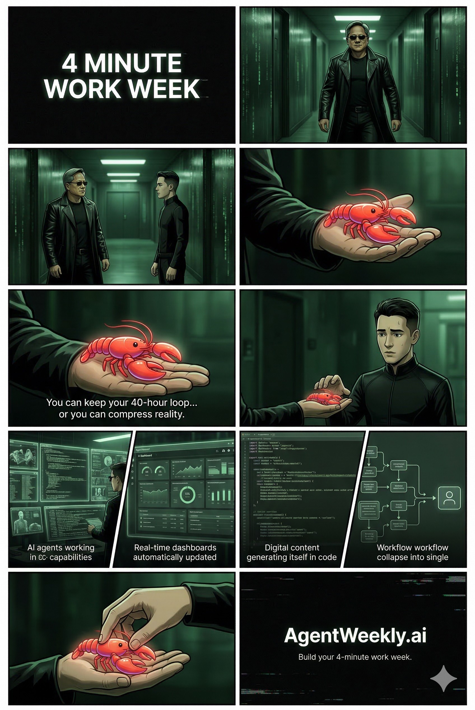

# Special Report: The 4-Minute Work Week
## Guide to Agentic AI & the DEAL Framework

*Originally published at [agentweekly.ai/guide/4mww](https://agentweekly.ai/guide/4mww)*

---

## Executive Summary

Tim Ferriss's 4-Hour Workweek principles — DEAL: Definition, Elimination, Automation, Liberation — and digital-nomad tactics can now be augmented by modern agentic AI. Since 2022, numerous LLM-driven agent frameworks (AutoGPT, BabyAGI, AgentGPT, LangChain, MetaGPT, Microsoft Autogen, etc.) and commercial AI assistants (Motion, Reclaim, Lindy, Saner AI, Superhuman, Notion AI, etc.) have emerged.

We catalogue these tools and map their capabilities to 4HWW tasks: scheduling agents (Motion/Reclaim) realize batching, email assistants (Saner AI/Superhuman) enforce a low-information diet, and multi-step agents (AutoGPT/BabyAGI) enable "set-and-forget" automation.

Safety and governance are critical: agentic systems must run in constrained contexts with human-in-the-loop checks, audit logs, and least-privilege credentials to mitigate hallucinations.

**Scope:** Digital nomads & location-independent professionals seeking to maximize freedom via automation.

---

## Agentic AI Frameworks

Agentic AI platforms emerged around 2023 to create LLM-driven "agents" that autonomously plan and execute tasks. They go beyond single-prompt chat by looping through planning, tool-using, and memory updates. Key open frameworks include:

**AutoGPT** — An open-source agent wrapper around GPT-4, enabling goal decomposition and tool/API integration. Provides a feature-rich framework for goal decomposition and external API use.

**BabyAGI** — A minimal Python framework (LangChain-based) that loops through task creation, execution, and prioritization using an LLM and vector DB. A proof-of-concept for goal-driven agents.

**AgentGPT / Agentify** — Web apps that allow users to deploy and run custom LLM agents via browser UI. They typically wrap GPT-4 or similar models in an autonomous loop.

**LangChain / LangGraph / MetaGPT** — Developer libraries to orchestrate complex multi-agent workflows. MetaGPT is an open-source 'agent architecture' template; LangGraph supports defining graphs of specialized agents.

**Microsoft Autogen / Copilot / CrewAI** — Autogen is a Microsoft LLM framework for multi-agent dialogs; Copilot offers 'bot-as-a-service' orchestration; CrewAI is a multi-agent stack for building persistent agentic systems.

**IBM watsonx Orchestrate** — IBM's enterprise offering for building 'digital employees' (agents) with compliance and security governance, integrating LLM calls with enterprise workflows.

**Claude (Anthropic) + MCP** — Anthropic's agentic interface allowing external memory and tools via the Model Context Protocol (MCP).

**Lindy (Moveworks)** — A no-code platform to configure AI assistants that span email, chat, and webhooks. Supports multi-step logic and persistent context.

**Replit Agent 3** — A developer-focused agent builder. Can autonomously test, debug, and fix code, and create other agents or Slack/Telegram bots from natural-language prompts.

**N8n AI (Beta)** — Workflow automation builder that now supports generating node flows from text prompts, turning 'prompts into living workflows'.

---

## Mapping Agents to DEAL Principles

Agentic AI can automate or augment nearly all of Ferriss's DEAL categories and tactics:

### D — Definition *(AutoGPT, CrewAI)*

Agents can assist goal clarification and planning. An LLM agent can outline life goals or transform high-level dreams into subgoals. Tools like MetaGPT or LangChain could take a prompt like "Plan a location-independent business" and output a step-by-step plan.

### E — Elimination / Low-Information Diet *(Superhuman AI, Saner AI)*

AI agents excel at filtering and summarizing information. An email assistant agent (e.g. Saner AI) can label and triage an inbox, letting you ignore low-value messages. A news aggregator agent could summarize daily news and present only what's relevant — matching Ferriss's 'selective ignorance' tactic.

### A — Automation *(Lindy, LangChain, Notion AI, Motion, Reclaim)*

Many tasks are directly automatable. Scheduling agents (Motion, Reclaim) cluster tasks and protect focus time. Content automation tools (Notion AI, ClickUp Brain) draft emails, blog posts, and outlines. Workflow agents (Lindy, LangChain) chain services end-to-end — e.g. when an email arrives, extract tasks and create them in Todoist automatically.

### L — Liberation *(AutoGPT + APIs, financial bots)*

Agents enable true remote control by handling operations. An agentic business backend (combining GPT, Stripe API, scheduling API) can handle order-taking and support for a digital product with minimal human oversight. A CFO agent could automatically prepare expense reports — empowering 'mini-retirements' while the AI runs the business.

**Also mapped:**

**Fear-Setting & Risk Analysis** — LLM agents could operationalize Ferriss's fear-setting by enumerating worst-case scenarios — e.g. an agent using a rules engine to list legal/tax/financial failure modes. Build a custom assistant in Lindy or LangChain to do it.

---

## Tools, Integrations & Pricing

| Tool | Category | Use Case | Pricing (approx.) |
|------|----------|----------|-------------------|
| Motion | Task Scheduling | Auto-schedule tasks, meetings, focus blocks | ~$30–50/user/mo |
| Reclaim.ai | Task Scheduling | AI-driven calendar, focus time protection | $9–12/user/mo |
| Lindy | Workflow Automation | Email triage, lead gen, task automation | Quote (enterprise) |
| Saner AI | Email Productivity | Unified inbox: email, calendar, note-taking | Freemium; ~$25/mo+ |
| Superhuman AI | Email Productivity | High-speed email triage, draft assistance | ~$55–70/year |
| Notion AI | Knowledge Work | Summarize docs, generate ideas, outlines | $10/seat/mo (add-on) |
| ClickUp Brain | Knowledge Work | End-to-end workspace AI: docs, scheduling | ~$19+/user/mo (Enterprise) |
| Otter.ai | Meetings / Docs | Transcribes and summarizes meetings | $10–20/user/mo |
| Replit Agent 3 | Virtual Assistant | Code assistant, bot creator, auto-debug | Free (beta) |
| CrewAI | Multi-Agent | Multi-agent orchestration frameworks | Quote (enterprise) |
| Microsoft Copilot | Multi-Agent | Bot-as-a-service, M365 integration | $20/user/mo (standalone) |
| AutoGPT / BabyAGI | Open Source | Goal decomposition, task loops (DIY) | Free (LLM API costs apply) |
| IBM watsonx Orchestrate | Enterprise | Digital employees with compliance governance | Quote (enterprise) |
| Cleo AI | Personal Finance | Spend tracking, budget insights via chat | Free; ~$5–10/mo premium |

---

## 3–6 Month Transition Roadmap

How to go from a 4-hour workweek to a 4-minute workweek using agentic AI:

**Phase 1 — Assess & Pilot (Weeks 1–4)**
- Clarify goals & metrics
- Pilot remote workdays
- Identify repetitive tasks
- *Milestone: Daily plan defined*

**Phase 2 — Implement Automation (Weeks 2–8)**
- Train agents on core tasks
- Build SOPs & workflows
- Deploy AI assistants (email, scheduling)
- *Milestone: Key workflows automated*

**Phase 3 — Scale & Optimize (Weeks 6–24)**
- Hire VAs/assistants as needed
- Integrate more APIs/tools
- Monitor KPIs & refine agents
- *Milestone: 80% tasks delegated*

---

## Safety, Governance & Failure Modes

Agentic AI systems are powerful but error-prone. Treat agents as powerful interns that still need management — not as unsupervised employees.

**Hallucinations** — LLM agents can confidently produce false data. Best practice is human-in-the-loop: an agent suggests a purchase but requires user confirmation before proceeding.

**Goal Misalignment** — Agents can misinterpret objectives. Define constrained tasks with clear goals. Successful agents "operate in constrained contexts with clear objectives… and keep humans in the loop."

**Lack of Transparency** — Most agentic systems act as black boxes. Modern frameworks emit step-by-step 'thoughts' logs for auditing. Implement tracing and audit logs.

**Security & Privacy** — Agents often require API keys (email access, Slack bots). Follow least-privilege: give agents only the scopes they need. For sensitive tasks, prefer manual overrides or multi-factor approvals.

**Regulatory Risk** — In cross-border contexts, ensure agents conform to data sovereignty rules (GDPR, travel privacy laws). Document data handling policies for any PII.

**Failure Modes** — Agents may get stuck or loop. Include watchdogs: timeout mechanisms, rollbacks. If a task drags on, the system should alert a human.

---

## Example Agentic Business Pipeline

A typical lead-to-delivery pipeline, showing agent roles replacing manual steps:

1. **Lead Captured** — Form / Email *(Trigger)*
2. **Qualification Agent** — Rules & scoring (Lindy/CrewAI) *(Decision)*
3. **Scheduling Agent** — Sends meeting invite (Motion) *(Action)*
4. **Payment Agent** — Invoice or checkout (Stripe API) *(Action)*
5. **Order Agent** — Creates project & tasks (ClickUp) *(Action)*
6. **Delegate Agent** — Assigns to VA/contractor *(Routing)*
7. **Delivery Agent** — Draft → Review → Deliver (AutoGPT) *(Execution)*
8. **Support Agent** — Post-delivery queries *(Service)*
9. **Accounting Agent** — Records payment & metrics *(Reporting)*

> Any step may escalate to human-in-the-loop intervention when the agent encounters uncertainty.

---

## Ready to automate?

Stop working for your business. Make your business work for you.

Post your listing in the [Agent Weekly Classifieds](https://agentweekly.ai/classifieds) and put an AI agent to work today. Delegate the tasks, keep the results.
